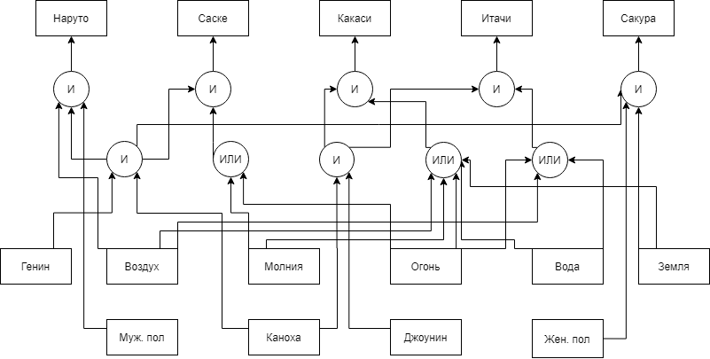
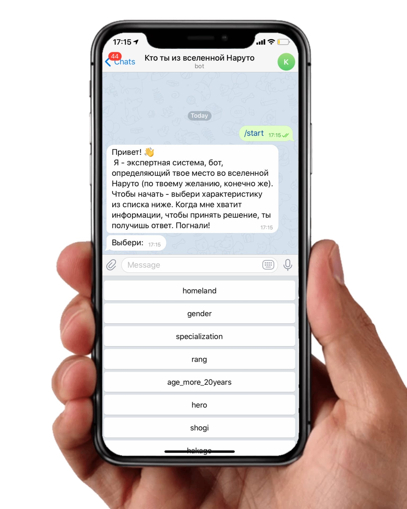
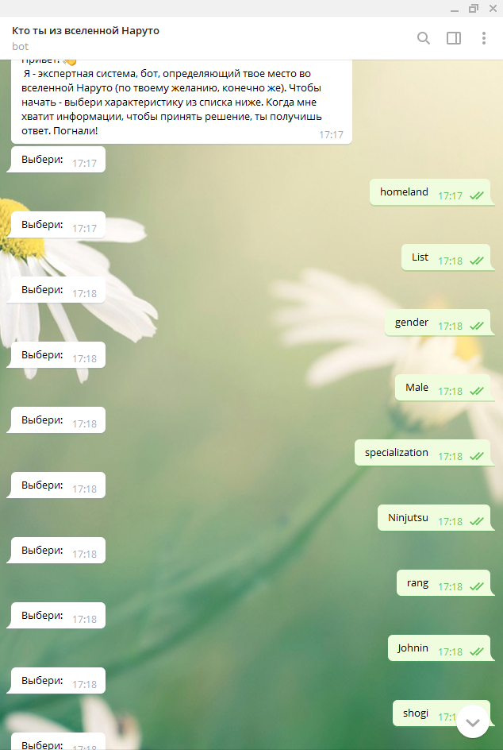
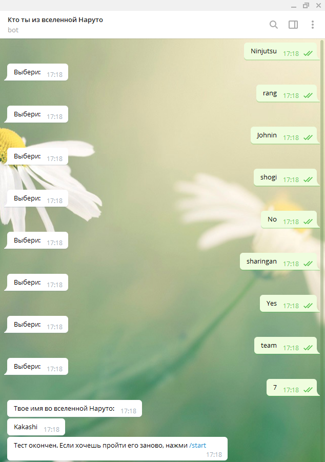

# Отчет по лабораторной работе
## по курсу "Искусственый интеллект"

### Студенты: 

| ФИО       | Роль в проекте                     | Оценка       |
|-----------|------------------------------------|--------------|
| Вепринцев Борис Ильич | Руководитель проекта. Помощь в отладке бота. Разработка базы знаний |          |
| Батяновский Иван Тарасович| Помощь написание алгоритма вывода. |       |
| Кузьмин Дмитрий Юрьевич| Написание алгоритма вывода. Разработка базы знаний|      |
| Усачёва Елизавета Игоревна| Реализация Бота в Телеграме. Создание, деплой, логика.  |          |

## Результат проверки

| Преподаватель     | Дата         |  Оценка       |
|-------------------|--------------|---------------|
| Сошников Д.В. |    28.05.2020          |      3.8         |

> *Опоздание в сдаче отчёта. Представление знаний по сути является таблицей, а не задействует механизм рассуждений.*

## Тема работы

Предметной областью для реализации экспертной системы является набор персонажей из анимационного сериала "Наруто".
Результатом работы системы будет являться конкретный персонаж, взятый в соответствии с выбраными пользователем характеристиками.

## Концептуализация предметной области

Опишите результаты концептуализации предметной области:
 - выделенные понятия
 - связи между ними, тип получившейся онтологии (словарь, сеть, иерархия и т.д.)
 - опишите возможные статические и динамические знания
 - как предметная область может быть разделена между участниками для коллективного создания базы знаний 
 
 Для визуализации была составлена блок схема и в последствие, для наглядности, таблица Excel с характеристиками и их значениями, проиндексированная по именам персонажей. Было решено прописать отдельный класс пресонажа(Class_Naruto), набор словарей, часть которых была необходима для корректной работы бота(например translate использующися для перевода названий характеристик с русского на английский), другая часть - это набор характеристик конкретного персонажа с соответсвующими значениями(эти словари носят имена персонажей), а также списки, носящие название характеристик с перечисленными возможными значениями.
 Каждому объекту в классе(персонажу) присваивается свой словарь с хакактеристиками и значениями.

Пример упрощенной графической иллюстрации от нескольких персонажей:


## Принцип реализации системы

Было решено реализовать систему на python, т.к в будущем это облегчало интеграцию системы в чат-бота.



```python
def keyboard_func(message):
    markup = types.ReplyKeyboardMarkup(resize_keyboard=True)
    for item in list_of_spec:
        markup.add(item)
    bot.send_message(message.chat.id, "Выбери:", reply_markup=markup)
```
Бот предлагает пользователю ввести значение характеристики на выбор. После того, как пользователь отправлет значение, бот обновляет список персонажей с помощью методов find и comparing. Это происходит пока длина списка, где хранятся герои, не станет равен 1, в случае нахождения персонажа, или пока длина не станет равной 0, в противном случае.
```python
if len(persons) == 1:
            bot.send_message(message.chat.id, const.finish_answer1)
            bot.send_message(message.chat.id, persons[0].dictionary['name'])
            bot.send_message(message.chat.id, const.finish_answer2)
            list_of_spec = ['/start']
            keyboard_func(message)
        elif len(persons) == 0:
            bot.send_message(message.chat.id, const.error_answer)
            list_of_spec = ['/start']
            keyboard_func(message)
        else:
            list_of_spec = unknown_person.comparing(persons)
            keyboard_func(message)
```


Для интеграции в основной файл с ботом (bot.py) была импортирована библиотека с методами для работы над спискми с персонажами(Naruto.py).
## Механизм вывода
Есть общий список героев. Получая у пользователя данные(значение определенных атрибутов), мы обновляем этот список.
```python
    def find(self, naruto_all, attribute):
        target = []
        for character in naruto_all:
            if character.dictionary[attribute] == self.dictionary.get(attribute):
                target.append(character)
        return target
```


Метод comparing удаляет атрибуты, которые сравнивать не имеет смысла.
```python
    def comparing(self, target):
        actual_attr = []
        a = target[0]
        for key in target[0].dictionary:
            for i in range(len(target)):
                if a.dictionary[key] != target[i].dictionary.get(key):
                    actual_attr.append(key)
                    break
        del actual_attr[0]
        return actual_attr
```

## Извлечение знаний и база знаний

Извлечение знаний происходило в совместной работе с экспертом - фанатом анимационного сериала "Наруто". Была составлена excel таблица, с важными параметрами в столбцах.

## Протокол работы системы
Пример работы системы(telegram username = @NarutoExpert_bot):




## Выводы

Данная лабораторная дала понимание того, как работают простые экспертные системы. Показала какие проблемы могут возникнуть: проблема создания базы знаний, а именно как представить знания эксперта в определенной предметной области, различные проблемы реализации механизма вывода. Для быстрой передачи информации было использовано приложение discord. В основном пробелма состояла в получении знаний и их преобразование(так как не всегда было понятно как эти знания представить в архитектуре), написание бота и его отладка.
